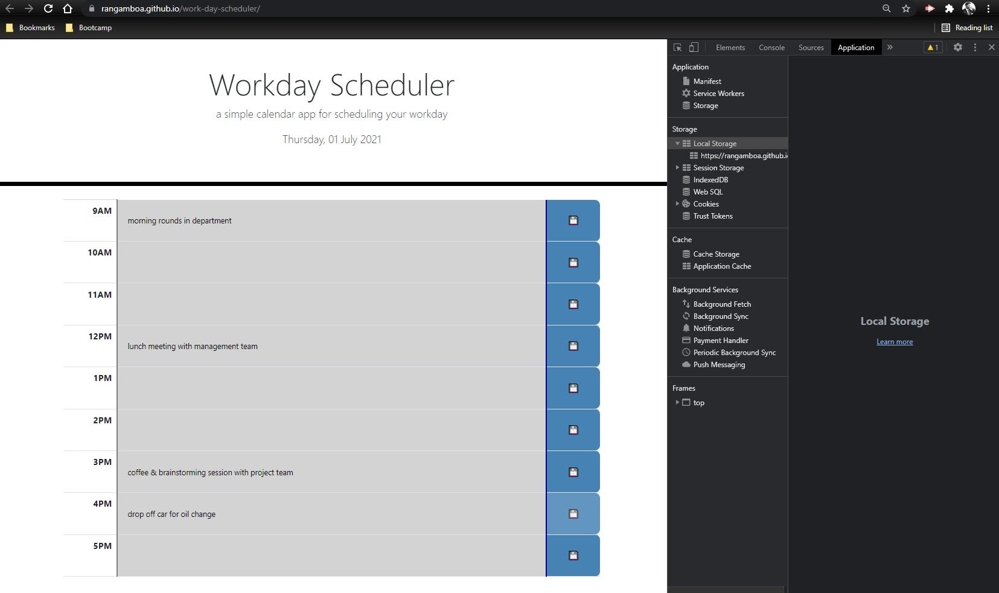
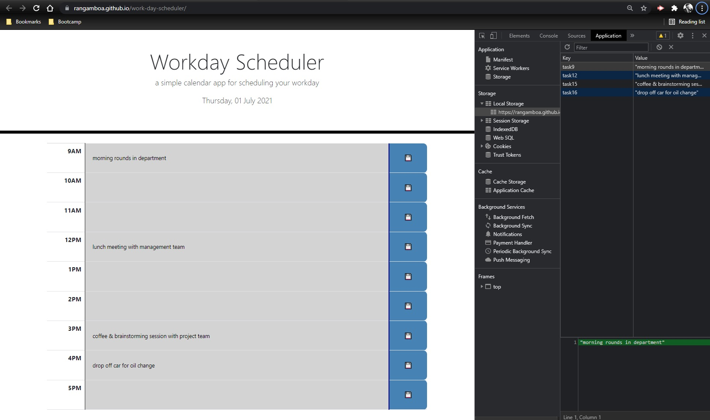
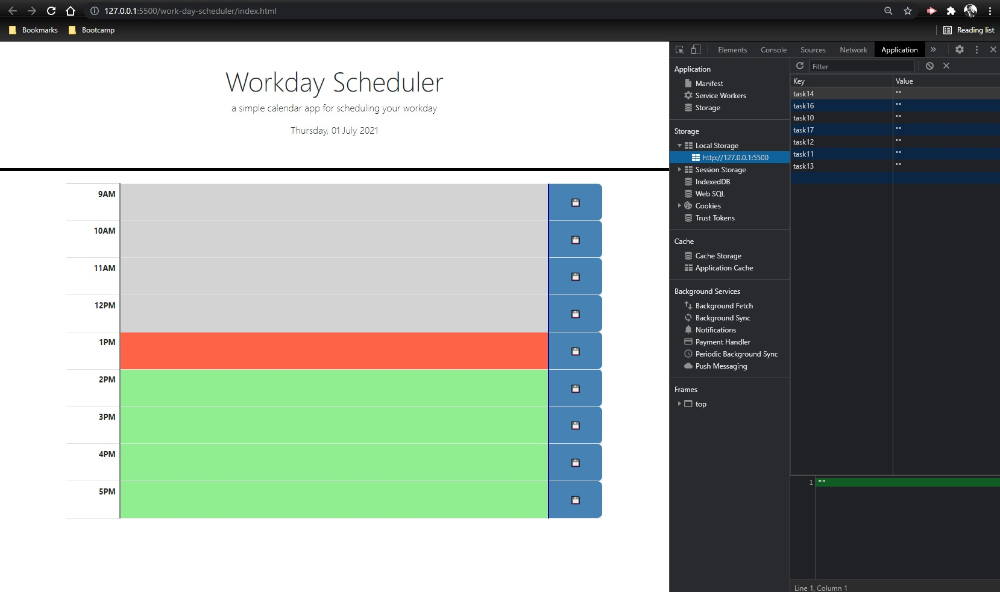

# Work Day Scheduler

## Task

Generate a simple daily calendar app that records tasks for a business day. Tasks can be saved to the browser and persist when the page is refreshed or reloaded. Code contains dynamically updated HTML and jQuery-powered CSS. Regularly-updated date and time in-browser are powered by Moment.js.

## Process

Wireframing and pseudo-coding were essential in planning layout, code and styling. Each step was broken down into smaller, more manageable tasks. The jumbotron and calendar were built with Bootstrap modified slightly with custom styles. Each cell in the calendar table was given a unique ID to be manipulated via jQuery function calls.

After the page loads, the current date is displayed on the jumbotron using Moment.js. Timeblocks on the calendar also display in different colors depending on the current hour-- grey for past hours, red for current hour and green for future hours. As this is dynamic, colors will change as time passes.

The user is able to enter tasks or notes on any timeblock. The note is then saved to local storage by clicking the "save" icon in the third column, then by using a system of function calls to parse tag classes and IDs and string manipulation to properly assign content. The information is then persistent, and will display upon page reload. I'm thinking there are likely several more elegant solutions than the one I devised, but this one works pretty well. I will revisit my code in the future to see what I can do to streamline/optimize the calls. Some of it seemed redundant so I'd like to figure out how to make my code more efficient. I'd also like to build a "Clear All" button to wipe the calendar clean.

## Resources

I mostly used the class sessions and materials to create this site. I also consulted various tutorial and general resources websites including:

* W3Schools
* MDN
* Stack Overflow
* Bootstrap
* jQuery
* Moment.js

## Link to Deployed Github Page

[Work Day Scheduler](https://rangamboa.github.io/work-day-scheduler)

## Screenshots

First two screenshots were taken "after business hours" so timeblock coloring functionality is not apparent:

This is how dynamic timeblock coloring would look if the screenshot were taken anytime from 1:00p-1:59p:

- - -
© 2021 Ran Gamboa